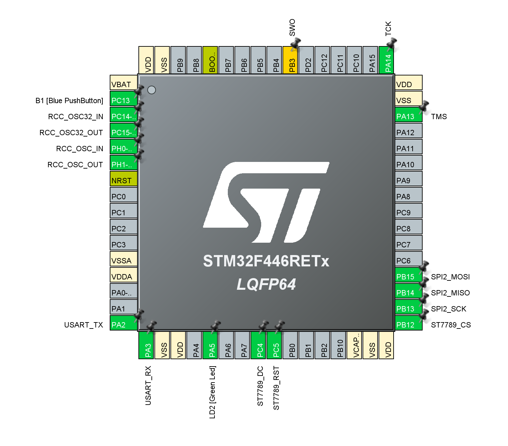
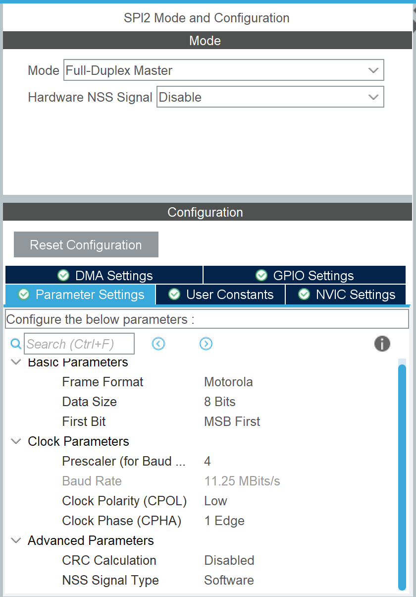
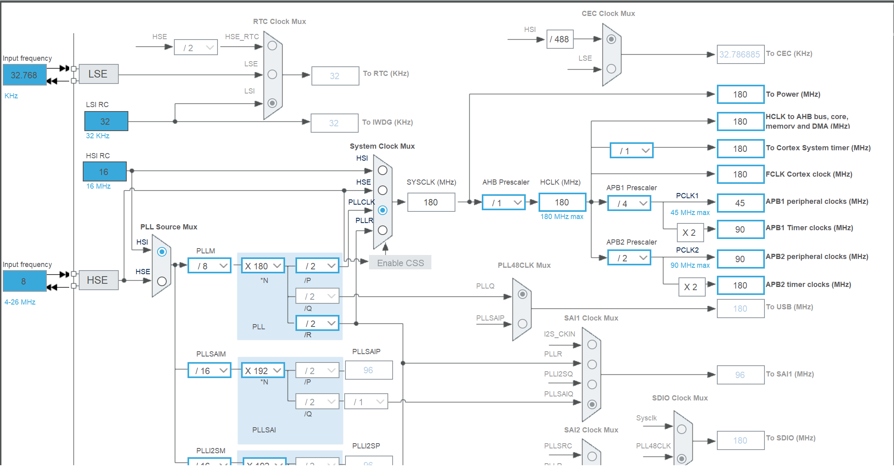
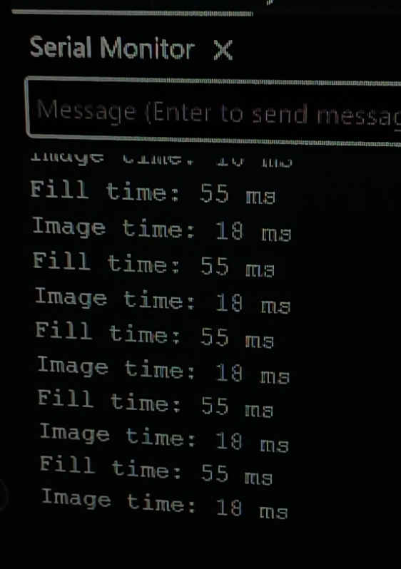

# STM32F446RE + ST7789 TFT Display Driver & Performance Benchmarks

[](https://www.st.com/en/microcontrollers-microprocessors/stm32f446re.html)
[](https://www.displayfuture.com/Display/datasheet/controller/ST7789V.pdf)
[]()
[]()

High-performance ST7789 (240×320 2.4" SPI TFT LCD) display driver bring-up and benchmarking implementation for the **STM32F446RE** microcontroller.

This repository serves as **Phase 1** of a larger embedded vision project aimed at streaming real-time video feeds from an OV7670 camera via DCMI + DMA to the TFT display.

---

## 🎥 Hardware Demo & Benchmark

https://github.com/user-attachments/assets/demo.mp4

<div align="center">
  <video src="Docs/demo.mp4" controls="controls" width="100%" style="max-height:500px;">
    Your browser does not support the video tag.
  </video>
  <p><em>ST7789 240×320 Display Rendering Demo on STM32F446RE</em></p>
</div>

---

## 📌 Features & Highlights

- **240×320 Native Resolution Support**: Added custom configuration macros and display dimensions.
- **DMA Acceleration**: Non-blocking SPI transfer pipeline utilizing Direct Memory Access (DMA) for fast frame rendering.
- **RGB565 Endianness Fix**: Corrected big-endian byte-swapping during DMA transmissions, fixing color distortion issues (e.g., pinkish reds and orange yellows).
- **SPI Clock Optimization**: Tuned SPI2 prescaler to **2** for maximum bandwidth, reducing full-screen fill time by **50%**.
- **Display Orientation Calibration**: Tested and locked rotation configuration (`ST7789_ROTATION 2`) and shift compensation for full frame buffer alignment.
- **Performance Benchmarking**: Measured exact render times for full-screen fills and sub-window image updates.

---

## 🛠️ Hardware Specification

| Component | Specification / Configuration |
| :--- | :--- |
| **Microcontroller** | STM32F446RE (ARM Cortex-M4 @ up to 180 MHz) |
| **Display Panel** | ST7789 2.4-inch IPS/TFT Display (240×320 pixels) |
| **Communication Interface** | SPI2 (Prescaler = 2) |
| **Data Format** | 16-bit RGB565 |
| **Transfer Pipeline** | SPI TX with DMA |
| **IDE & Framework** | STM32CubeIDE + STM32F4 HAL |

### ⚙️ Peripheral & CubeMX Configuration

#### 📍 Pinout & GPIO Configuration


#### 🔌 SPI2 Parameter & DMA Settings


#### ⚡ Clock Tree Configuration


---

## 🚀 Performance Benchmarks

All benchmark metrics were collected operating at maximum tuned SPI clock rates with DMA enabled.

| Test Operation | Target Resolution | Frame Time | Frame Rate (FPS) | Notes |
| :--- | :---: | :---: | :---: | :--- |
| **Full-Screen Fill** | 240 × 320 | **56 ms** | **~18 FPS** | Complete panel write using DMA color fill |
| **Image Frame Render** | 213 × 120 | **18 ms** | **~55 FPS** | Simulates future camera video window feed |

### 📊 Benchmark FPS Result Output


### SPI Clock Tuning Impact

| SPI Configuration | Full-Screen (240×320) Fill Time |
| :--- | :---: |
| Default SPI Prescaler | 110 ms |
| **Optimized (Prescaler = 2)** | **55 ms** (2x Speedup) |

---

## 🔧 Core Library Modifications

The base driver was originally designed for smaller variants (135x240, 170x320, 240x240). Key adjustments included:

1. **Resolution Macros**: Added `USING_240X320` alongside `ST7789_WIDTH 240` and `ST7789_HEIGHT 320` in `st7789.h`.
2. **Rotation & Offset**: Set `ST7789_ROTATION 2` and verified shift values (`X_SHIFT`, `Y_SHIFT`) to prevent cropped coordinate spaces.
3. **RGB565 Endian Swapping**: Injected byte-swap routine before triggering DMA block transfers to align with the ST7789 big-endian SPI stream protocol.
4. **DMA Acceleration**: Verified SPI TX DMA channel stability after initial polled SPI bring-up.

---

## 📂 Repository Structure

```text
.
├── Core/
│   ├── Inc/
│   │   ├── main.h             # Pin assignments & peripheral header
│   │   ├── st7789.h           # ST7789 configuration, resolution macros & function declarations
│   │   ├── fonts.h            # Font definitions
│   │   └── image.h            # Test image header
│   └── Src/
│       ├── main.c             # Application entry point & benchmark loop
│       ├── st7789.c           # ST7789 driver implementation & DMA send logic
│       ├── fonts.c            # Font lookup tables
│       └── image.c            # Test image array data (RGB565)
├── Docs/
│   ├── ST7789_Library_Modifications.md  # Detailed modification log & technical notes
│   ├── STM32_ST7789_Display_Benchmark.md # Benchmark breakdown & milestone documentation
│   ├── clock_config.png                 # STM32CubeMX RCC clock configuration
│   ├── pin_config.png                   # STM32CubeMX pinout diagram
│   ├── spi_config.png                   # SPI2 peripheral & DMA parameters
│   ├── fps_result.png                   # Benchmark FPS & execution time log
│   └── demo.mp4                         # Display demo video clip
├── Drivers/                    # STM32F4xx HAL and CMSIS driver packages
├── .gitignore                  # Git ignore rules for STM32CubeIDE build output
├── STM32F446RETX_FLASH.ld      # Linker script for flash execution
└── tft_test.ioc                # STM32CubeMX device configuration file
```

---

## 🗺️ Project Roadmap

- [x] **Phase 1**: ST7789 240x320 display bring-up, DMA integration, & performance benchmarking.
- [ ] **Phase 2**: Custom DMA-optimized line-buffered display driver.
- [ ] **Phase 3**: OV7670 camera initialization via I2C (SCCB).
- [ ] **Phase 4**: Frame capture using STM32 DCMI + DMA.
- [ ] **Phase 5**: Live camera feed streaming to ST7789 display (~30+ FPS goal).

---

## 💡 How to Build & Flash

1. Clone this repository to your workspace:
   ```bash
   git clone https://github.com/Jayant-devs/STM32-ST7789-Driver.git
   ```
2. Open **STM32CubeIDE**.
3. Go to **File -> Import... -> General -> Existing Projects into Workspace**.
4. Select the cloned repository directory and click **Finish**.
5. Build the project (**Ctrl + B** or click **Build**).
6. Connect your **STM32F446RE Nucleo** board via USB and click **Run / Debug**.

---

## 🤝 Acknowledgments

The core ST7789 library implementation in this project is based on the initial work by **Floyd-Fish**:
- Original Repository: [Floyd-Fish/ST7789-STM32](https://github.com/Floyd-Fish/ST7789-STM32)

---

## 📄 License

This project is open-source and available under the [MIT License](LICENSE).
